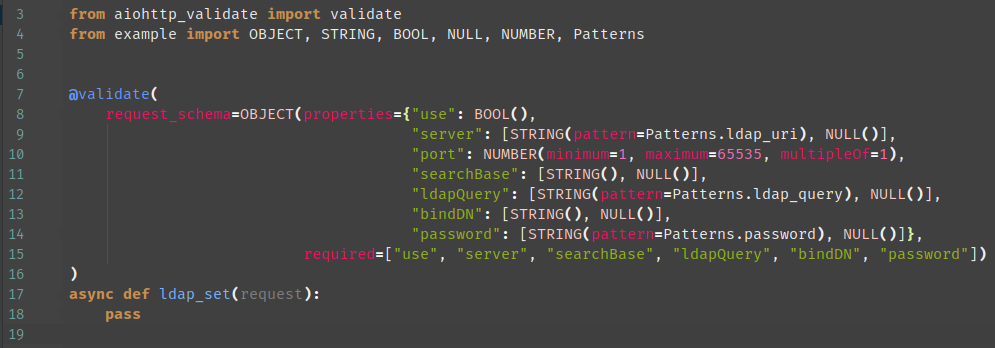
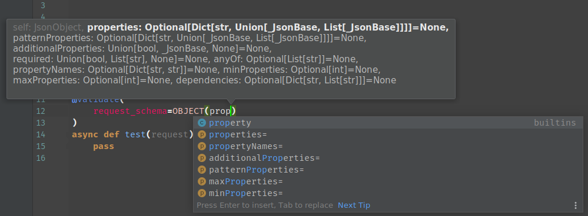

### Pretty JsonSchema
Helps you simply create and visualize jsonschema in your IDE.  
Support Draft6Validator.


**This is what it looks like in IDE:**



**Support tips and autocomplete:**



### Installation

```bash
pip3 install git+https://github.com/delatars/pretty_jsonschema
```
### Usage

```python
from pretty_jsonschema import *

STRING = JsonString()
INTEGER = JsonInteger()
NUMBER = JsonNumber()
BOOL = JsonBool()
NULL = JsonNull()
ARRAY = JsonArray()
OBJECT = JsonObject()
```

#### Features
- Fast and easy constructing schemas.
- Support tips and autocomplete.
- More elegant and human-readable view in IDE.
- Support Draft6Validator